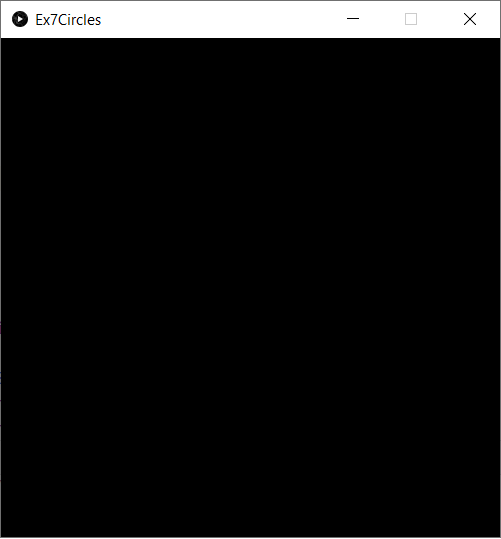
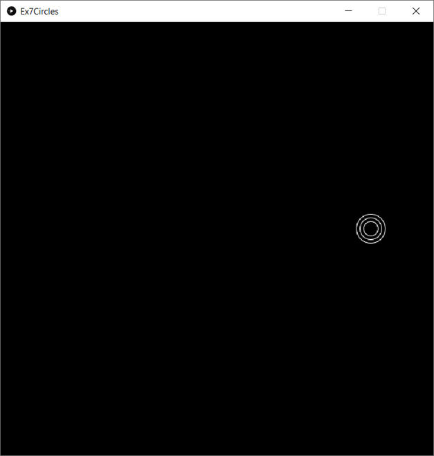
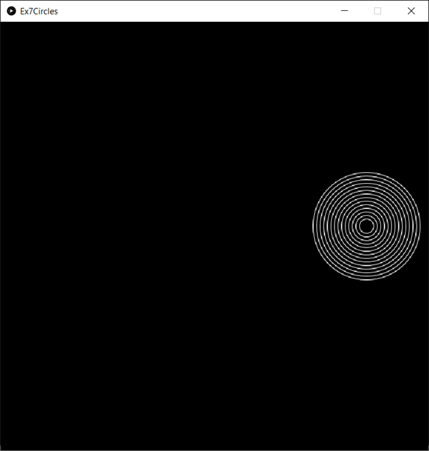
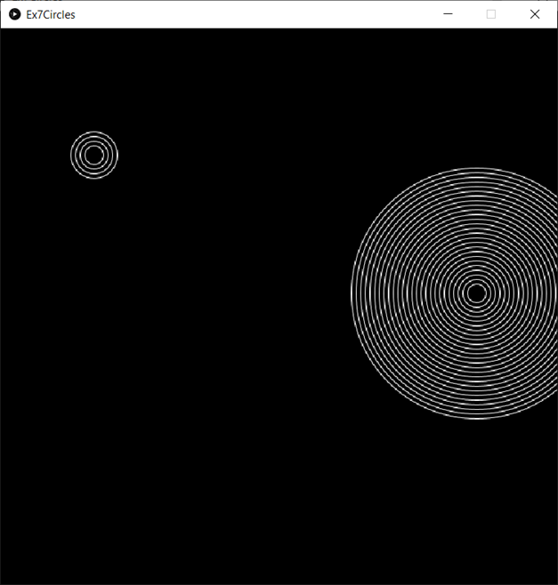
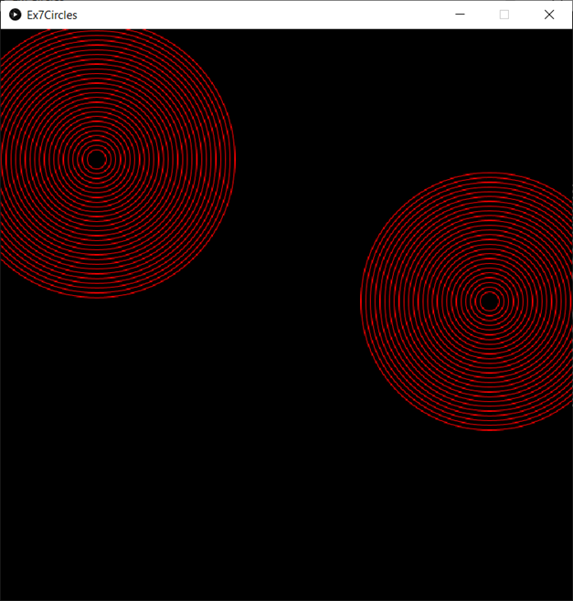
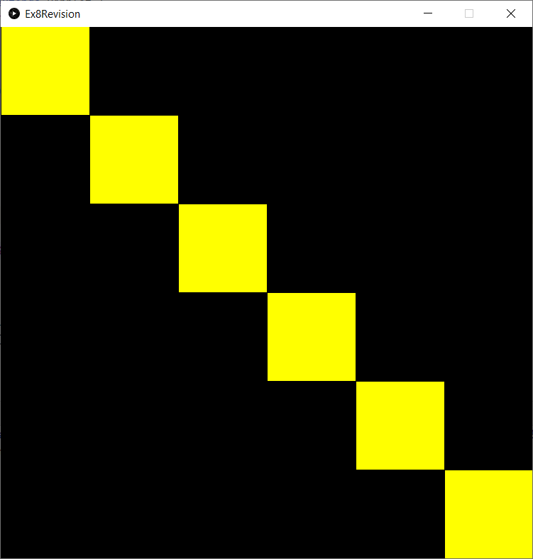
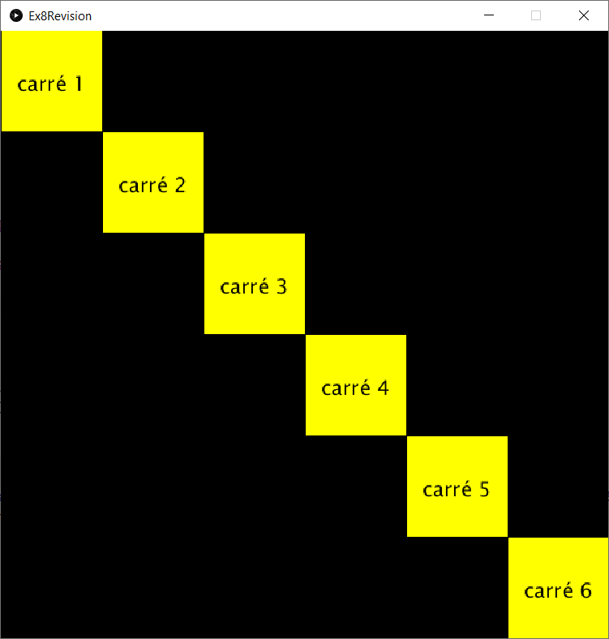
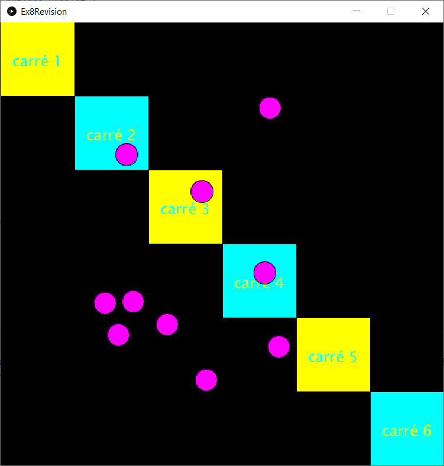
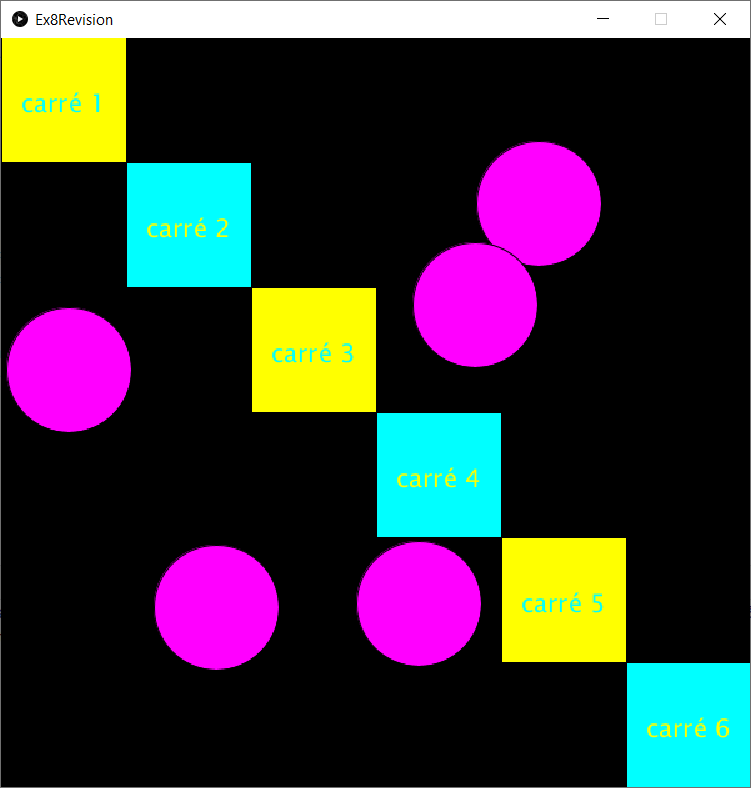

# Exercices #
Ce projet propose quelques exercices simples avec pour objectifs:
- pratiquer IntelliJ
- revoir les notions de bases:
    - if
    - switch
    - for
    - array
    - état (variables "globales")
    
## if ##
L'instruction if est utilisé pour exécuter du code uniquement si une condition est remplie.

Voici un petit extrait de code démontrant comment utiliser if:
```java
int clef = 5;
if (clef < 10) {
    System.out.println("clef est plus petit que 10");
} else {
    System.out.println("clef est plus grand ou égal à 10");
}
```

Développons une application 
qui affiche un fond d'écran turquoïse lorsque la souris est dans la partie supérieure de la fenêtre
et un fond d'écran jaune lorsque la souris est dans la partie inférieure.

.

Réimplémenterons (@override) les méthodes suivantes de PApplet:
- settings
- setup
- draw

et nous utiliserons les méthodes suivantes de PApplet:
- size
- background
- line

Une solution est [disponible sur github](https://github.com/jedepaepe/java-4118/blob/master/lesson-09-intellij/exercices/src/Ex1If.java).

## switch ##
L'instruction switch est utilisé 
lorsque nous avons plusieurs conditions impliquant toujours la même variable.
Voici un extrait de code utilisant l'instruction switch:
```java
int clef = 5;
switch (clef) {
    case 1:
        System.out.println("cas 1");
        break;
    case 5:
        System.out.println("cas 5");
        break;
    default:
        System.out.println("cas par défaut");;
}
```

Créons une application 
qui affiche un cercle de 50px de rayon centré sur la souris
et dont la couleur est:
- bleue si nous tapons b, color(0, 0, 255)
- jaune si nous tapons j, color(255, 255, 0)
- mauve si nous tapons m, color(255, 0, 255)
- noir si nous tapons n, color(0)
- orange si nous tapons o, color(255, 153, 51)
- rouge si nous tapons r, color(255, 0, 0)
- turquoise si nous tapons t, color(0, 255, 255)
- vert si nous tapons v, color(0, 255, 0)
- blanc pour tout autre caractère, color(255) (utilisation du break)

Voici un exemple de résultat à l'exécution:


Pour coder l'application,
nous réimplémentons (@override) les méthodes suivantes de PApplet:
- settings
- setup
- draw
- keyReleased

et nous utilisons les méthodes suivantes de PApplet:
- size
- background
- fill
- circle

Une solution est [disponible sur github](https://github.com/jedepaepe/java-4118/blob/master/lesson-09-intellij/exercices/src/Ex2Switch.java).

## for ##
L'instruction for sert à répéter un bloc d'instructions à plusieurs reprises.
Voici un exemple d'utilisation de for:

```java
for (int x = 10; x <= 50; x += 10) {
    line(x, 0, x, height);
} 
```
Le bloc de code `line(x, 0, x, height);` est exécuté à 5 reprises avec des valeurs de x différentes:
1. x = 10
1. x = 20
1. x = 30
1. x = 40
1. x = 50

L'initialisation de x est réalisée par l'instruction `int x = 10;` dans l'instruction `for (int x = 10; x <= 50; x += 10)`.\
L'incrémentation de 10 est réalisée par l'instruction `x += 10` toujours dans l'instruction `for(...)`.\
La sortie de la boucle est réalisée par la instruction `x <= 50` toujours dans l'instruction `for (...)`.

Le résultat de l'exécution du code ci-dessus est:


Créons maintenant une application 
qui dessine 4 carrés jaunes centrés sur la souris de 15, 30, 45, 60 pixels
lorsque l'utilisateur clique.
Voici un exemple de résultats possibles:


Pour coder l'application,
nous réimplémenterons (@override) les méthodes suivantes de PApplet:
- settings
- setup
- draw
- mousePressed

et nous utiliserons les méthodes suivantes de PApplet:
- background
- noFill
- stroke
- rectMode
- square

Une solution est [disponible sur github](https://github.com/jedepaepe/java-4118/blob/master/lesson-09-intellij/exercices/src/Ex3For.java).

## array ##
Les arrays sont des listes, par exemple:

```java
int[] listeDEntiers ={ 10, 3, 20, 15 };

// multiplier par 2 tous les éléments de la liste
for (int i = 0; i < listeDEntiers.length; ++i) {
    listeDEntiers[i] = listeDEntiers[i] * 2;
}

// affichier tous les éléments de la liste dans la console
for (int item : listDEntiers) {
    System.out.println(item);
}
```

Réalisons une application qui affiche 5 carrés centrés sur la souris dont les largeurs sont 10, 20, 35, 52, 71
en utilisant l'array:

```java
int[] sizes = {10, 20, 35, 52, 71};
```

Nous "ralentissons" l'application en diminuant le frameRate à 4 "images" par seconde:

```java
frameRate(4);
```

Voici un résultat possible:


Pour coder l'application,
nous réimplémentons (@override) les méthodes suivantes de PApplet:
- settings
- setup
- draw

et nous utilions les méthodes:
- size
- frameRate
- rectMode
- background
- noFill
- stroke
- square

Une solution est [disponible sur github](https://github.com/jedepaepe/java-4118/blob/master/lesson-09-intellij/exercices/src/Ex4Array.java).

## Etat ##
L'état contient l'information nécessaire à l'application.
Cette information dépend de la logique de l'application
et évolue pendant l'exécution de l'application.
L'application réagira différemment suivant son état.

Par exemple, l'état d'une partie d'échec sera composé
- de la position de toutes les pièces;
- du joueur qui doit jouer le prochain coup.

Lorsqu'on travaille avec PApplet, nous placerons les variables d'état juste après la déclaration de la classe,
par exemple:

```java
import processing.core.PApplet;

public class MaClasse extends PApplet {
    int stateVar1 = 10;
    String stateVar2 = "hello";
}
```

### Etat : exercice simple ###
Ecrivons une application qui affiche un écran rouge. Lorsque nous cliquons ou nous pressons une touche clavier,
la couleur de fond change en vert, puis bleu, puis rouge, puis vert, puis bleu, puis rouge ...


Nous aurons donc besoin d'une variable d'état qui mémorise la couleur, ou plus simplement l'étape:

```java
int step = 0;
```

- si step vaut 0, l'écran est rouge
- si step vaut 1, l'écran est vert
- si step vaut 2, l'écran est bleu

La variable step doit donc être incrémentée à chaque click souris ou touche clavier:

```java
step = step + 1;
```

Mais attention step doit être compris entre 1 et 3.

Nous pouvons résoudre cela par une condition:

```java
step = step + 1;
if (step > 2) {
    step = 0;
}
```

ou nous pouvons utiliser l'opérateur %, ce qui est plus élégant:

```java
step = (step + 1) % 3;
```

Pour coder l'application,
nous réimplémentons (@override) les méthodes suivantes de PApplet:
- settings
- draw
- mousePressed
- keyPressed

Nous aurons aussi besoin des méthodes :
- size
- background

Finalement, nous pouvons aussi utiliser l'instruction switch pour gérer les différentes valeurs de step:

```java
switch (step) {
    case 0:
        // => rouge (à coder)
        break;
    case 1:
        // => vert
        break;
    case 2:
        // => bleu
}
```

Une solution est [disponible sur github](https://github.com/jedepaepe/java-4118/blob/master/lesson-09-intellij/exercices/src/Ex5StateSimple.java)

### Etat : exercice complexe ###
Créons un programme qui 
- dessine un cercle centré sur la souris lorsque l'utilisateur clique;
- redessine tous les cercles en
   - rouge lorsque l'utilisateur tape r ou R
   - vert lorsque l'utilisateur tape v ou V
   - bleu lorsque l'utilisateur tape b ou B
   - blanc pour tout autre caratère
    
Pour que l'application puisse redessiner tous les cercles,
il faut qu'elle mémorise leur position, par exemple avec trois variables d'état:
```java
// nombre maximum de cercles
final int maxCircle = 10;

// index du dernier cercle dessiné
int index = 0;

// positions x des cercles
int[] positionXs = new int[maxCircle];

// positions y des cercles
int[] positionYs = new int[maxCircle];
```

Notons que `maxCircle` n'est pas une variable d'état
mais une constante (mot clef java `final`)
qui permet de rendre le code plus lisible et plus maintenable
(`maxCircle` remplace 10 partout dans le code, ce qui permet d'ajouter du sens).

Pour gérer les couleurs, nous pouvons nous inspirer de l'exercice "switch".

Notons que nos listes sont ici limitées à 10 éléments.
Il faudra donc gérer le dépassement de 10.

Une solution consiste à limiter les index à [0, 10[,
ce que nous pouvons faire avec un if:

```java
if (index >= maxCircle) index = 0;
```

où plus élégant:

```java
index = index % maxCircle;
```

A l'éxécutions, nous obtenons ce type de résultats:


Pour coder l'application,
nous réimplémentons (@override) les méthodes suivantes de PApplet:
- settings
- draw
- mousePressed

et nous utilisons les méthodes:
- size
- background
- fill
- circle

Une solution est disponible [sur github](https://github.com/jedepaepe/java-4118/blob/master/lesson-09-intellij/exercices/src/Ex6State.java).

## Cercles inscrits ##

Codons une application qui dessine un cercle de 20 pixels de diamètre centré sur la souris lorsque l'utilisateur clique.

Ensuite, l'application dessine un second cercle de 30 pixels centré sur le même point.

Ensuite l'application dessine un troisième cercle de 40 pixels ...

Ensuite un quatrième cercle de 50 pixels ...

...

à raison d'environ 3 cercles par seconde.

Si l'utilisateur reclique, le processus recommence.

Si l'utilisateur tape le caractère 'r', tous les cercles sont redessinés en rouge.

Si l'utilisateur tape le caractère 'v', en vert.

'b' en bleu.

'j' en jaune.

't' en turquoïse.

'm' en mauve.

'w' en blanc.

La couleur initiale est le blanc.

Fenêtre au démarrage de l'écran:




L'utilisateur a cliqué dans la fenêtre et trois cercles sont déjà dessiné (la capture d'écran est effectuée environ 1 seconde après le click);



Quelques secondes plus tard:


Quelques secondes plus tard, l'utilisateur a cliqué une deuxième fois:


Quelques secondes plus tard, l'utilisateur a tapé le caractère 'r':


## révision ##

Cet exercice a pour but de revoir l'ensemble de compétences.

Il est réalisé en étape, chaque étape correspondant à une compétence.

### Etape 1 :  6 carrés sur la diagonale ###

Codons un programme qui dessine 6 carrés sur la diagonale à l'aide d'une boucle for.



Les carrés font 100x100 pixels.


### Etape 2 : numérotons les carrés ###

Nous obtenons



Les caractères font 20 pixels. 
Ils sont plus ou moins centrés.
Ils sont de couleur jaune (255, 255, 0)


### Etape 3 : différentes couleurs ###

Colorons les cercles et les textes en jaune et turquoie à l'aide de l'instructif if.


Nous utilisons le jaune et le turquoise (0, 255, 0).

### Etape 4 : souris ###

Dessinons un cercle à chaque click souris.



Les cercles sont mauves (255, 0, 255) et ont un diamètre de 30 pixels.

### Etape 5 : taille ###

Codons les fonctionnalités suivantes:

- lorsque l'utilisateur tape le caractère '+', tous les cercles grandissent de 10 pixels,
- lorsque l'utilisateur tape le caractère '-', tous les cercles grandissent de 10 pixels,
- la taille maximum des cercles est de 100 pixels,
- la taille minimum des cercles est de 10 pixels.



Pour implémenter cette fonction, nous devons utiliser la notion de tableau (array) et de variables d'états.

### Etape 7 : déplacer ###

Codons la fonctionnalité suivante:

- lorsque l'utilisateur utilise les caractères flèches, les cercles sont déplacés de 5 pixels dans la direction indiquée par la flèche (démo sur demande).

Nous utiliserons ici les [keyCode  de processing](https://processing.org/reference/keyCode.html).

### Etape 8 : entrer sortir ###

Maintenant, les cercles peuvent sortir de la fenêtre.

Modifions ce comportement de sorte que lorsqu'un cercle sort de la fenêtre, il entre par le côté opposé (démo sur demande).

Nous utilisons l'opérateur "reste" (%) pour résoudre ce problème.
